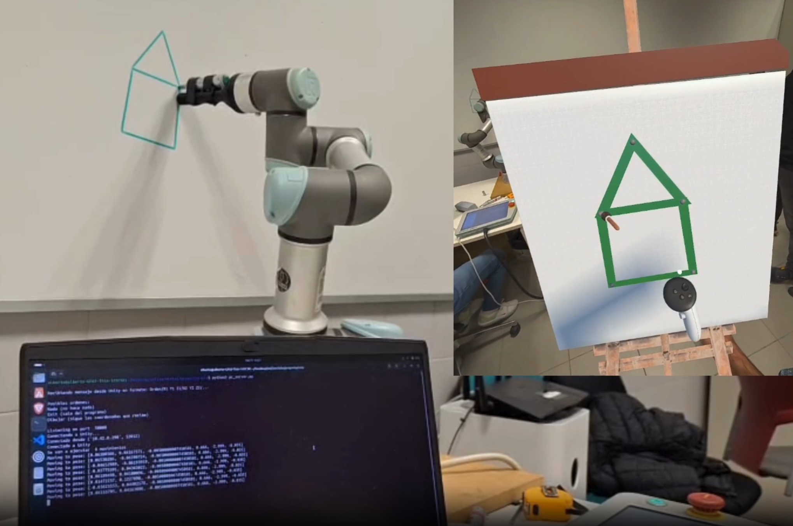
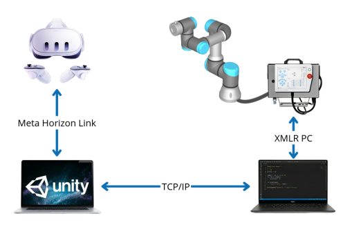

# UR3 Augmented Reality Teleoperation System for Robotic Art

<p align="center">
  
</p>

---

## 📊 Project Overview

[](#)
[-black.svg)](https://unity.com/)
[](https://developer.oculus.com/)
[](https://www.universal-robots.com/)
[](#)

**AR Painter** is an advanced robotic teleoperation system that combines Augmented Reality (AR Class 2 Display) with collaborative robotics. Built as a final group project for the Bachelor's Degree in Robotic Engineering at the University of Alicante, the system allows users to sketch paths on a virtual 3D canvas using a **Meta Quest 3** headset. These hand-drawn air gestures are translated in real-time into spatial coordinates, causing a physical **Universal Robots UR3 collaborative arm** to replicate the artwork onto a real whiteboard.

This framework yields massive potential for assistive accessibility (enabling individuals with severe motor disabilities to engage in artistic activities) and teleoperation within hazardous environments where a direct human presence is impossible.

---

## 🎬 Visual Demonstration
<details>
<summary>📦 <b>Click here to expand the visual demonstration</b></summary>

  Virtual environment painting:


  Physical environment painting: 


  Physical environment painting 2: 


</details>

## 🛠️ Technical Specifications & Prerequisites

### 💻 Software Stack
* **Unity 6.2 (6000.2.10f1)** containing the following SDK packages: Meta XR Core SDK, Meta XR Interaction SDK, OpenXR Plugin, and XR Plugin Management.
* **Python 3.x** installed on the server device.
* **Polyscope (Universal Robots)**: Compatible with CB3-Series controllers (optimized for `v3.15+`).
* **Visual Studio Code**: (Recommended IDE for managing script updates and Python server execution).

---

## 📁 Code Architecture & Components

The system relies on a decentralized multi-device network layout designed to distribute computational loads. Because direct APIs do not exist to link Meta ecosystems with Universal Robots, an intermediary communication bridge was custom-developed.
<p align="center">
  
</p>


### 🧠 Core Subsystems Breakdown:
1. **AR Environment Side (PC 1)**: Runs the real-time Unity interface. It leverages the host PC’s hardware (CPU, GPU, RAM) rather than running standalone on the headset, dramatically improving processing power and speeding up code deployment via **Meta Horizon Link**.
2. **Central Server Bridge (PC 2)**: Centralizes cross-platform traffic by initializing a multi-threaded **TCP/IP socket server** to intercept string instructions from Unity, and a local **XML-RPC server** to handle structural requests from the robot.
3. **Actuator Side (UR3 Arm)**: Connects to PC 2 via Ethernet IPv4. The Polyscope controller queries the XML-RPC server natively to parse motion data array poses (`x, y, z`).


<details>
<summary>📦 <b>Click here to expand the detailed code and script architecture</b></summary>

### 🎮 Unity Modules (Assets/Scripts)
* **`Pincel.cs` (Brush Script)**: The mathematical core of the interface. It tracks input triggers, enforces drawing boundary checks (ensuring points are discarded if drawn outside the canvas), maps spatial vectors to flat drawing planes , and commands the native Unity `LineRenderer` component to draw visible ink paths.
* **`Comunicacion.cs`**: Instantiates the TCP/IP socket client upon startup. It packages Vector3 and Quaternion game positions into parsed text strings formatted as:  
  `"<Action_Command>/<X_Coord>/<Y_Coord>/<Z_Coord>/"`. 
  It works asynchronously to prevent the main Unity rendering thread from freezing.

### 🐍 Python Server Modules
* **`pc_server.py`**: Runs on the central computer. Listens for incoming TCP/IP strings from Unity, reformats coordinate streams, and hosts the active XML-RPC function definitions.
* **`ur_lib.py`**: The official protocol helper provided by Universal Robots to bridge native Python methods with XML data formatting.

### 🤖 Robot Controller Scripts
* **`XMLR_PC.script` / `.urp`**: Program uploaded to the UR3 TP. Loops actively to poll the server for state cues via the XML-RPC layer, executing linear path interpolations (`MoveL`) across target coordinate clusters.

</details>

---

## 🎮 Interface Controls & Interaction

Interaction is mapped natively using the **Meta Quest Touch Pro** input actions framework:

* **Grip Buttons (Left/Right Hand)**: Grabs, drags, and repositions interactive 3D assets in space, such as the easel or brush tool.
* **Right Index Trigger**: Draws paths on the canvas. It behaves like classic desktop software (e.g., MS Paint)—sampling an initial tracking point on press and a final target point on release to dramatically minimize raw data congestion over the network.
* **Button A**: Instantly clears all visual vectors and flushes point coordinate tables.
* **Button X**: Submits the generated vector points from Unity over to the UR3 server queue for drawing execution.
* **Color Buckets**: Touching the Blue, Red, Green, or Yellow buckets shifts the visual brush hue for that complete drawing queue.

---

## 🚀 Quick Start & Execution Guide

The environment can be ran using a **Single PC setup** (using Loopback Local IPs) or a **Dual PC setup** (recommended for performance).
The UR3 tool center point (TCP) tool attachment must incorporate a passive compression spring mechanism. This absorbs tolerance offsets against the board and maintains uniform pressure without damaging the marker tip.

1. Connect both computers (if using the dual configuration) to the exact same network gateway. Establish a local area network connection by connecting the robot controller via an Ethernet cable to the server device and configure the Ethernet IPv4 interfaces to link the UR3 controller.
2. Define the **Feature Plane Workspace** on the UR3 pendant by moving the physical robot tool parallel across the whiteboard to capture the origin, X-axis direction, and Y-axis vector orientations.
3. Open the UR3 code program, verify it points to the correct Server Bridge IP, and press **Play**.
4. Connect the Meta Quest 3 via a Link Cable, navigate inside the headset settings, and boot **Meta Horizon Link**.
5. Boot up the terminal window on PC 2 and run the Python bridge:
   ```bash
   python pc_server.py


This system has been developed as a project in collaboration with Alejandro Sosa Viña and Miriam García de la Reina Padilla.

Use of this code or structure is encouraged, with the right considerations stated below. Any additional work or use of the code must make reference to at least one of the authors.

The software developed and presented within this repository has been tested and validated exclusively within the defined scope and under the specific conditions described throughout the project in the controlled laboratory conditions at the University of Alicante. Any modification of the source code, execution outside the recommended hardware or software environment, or use beyond the scenarios and safety assumptions established in this repository falls entirely outside the intended design. Therefore, the authors do not assume any responsibility or liability for potential malfunctions, unintended behaviors, or damages resulting from such uses or ocurring outside the authors' supervision. The use of the software developed must be executed with constant supervision of a qualified individual. It is the responsibility of any third party using this system to ensure proper validation and risk assessment before deployment.
